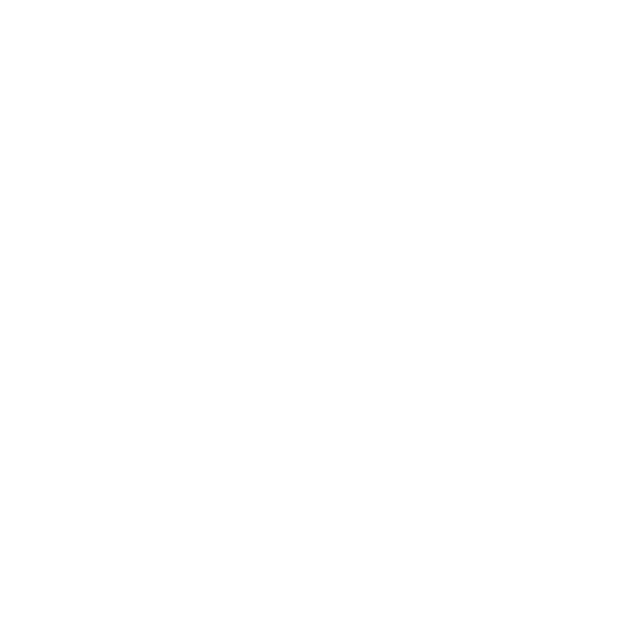

<p align="center">
    
</p>

[](https://github.com/BigBang1112/maniaapi-net/releases)
[](#)

A wrapper for these web APIs:

- [Nadeo API](https://webservices.openplanet.dev/) (official TM2020 ingame API)
- [Trackmania web API](https://doc.trackmania.com/web/web-services/)
- [ManiaPlanet web API](https://doc.maniaplanet.com/web-services)
- [Trackmania.io](https://openplanet.dev/tmio/api)
- [Trackmania Web Services](http://developers.trackmania.com/webservices/) (old TMF web API)
- [Trackmania Exchange](https://api2.mania.exchange/)
- [UnitedLadder](https://ul.unitedascenders.xyz/)
- XML protocol (for TMF, TMT, and ManiaPlanet)
- XML-RPC protocol (for TMF, ManiaPlanet, and TM2020)

This set of libraries was made to be very easy and straightforward to use, but also easily mocked, so that it can be integrated into the real world in no time.

### Packages

Anything you can imagine!

- [ManiaAPI.NadeoAPI](#maniaapinadeoapi)
- [ManiaAPI.NadeoAPI.Extensions.Hosting](#maniaapinadeoapiextensionshosting)
- [ManiaAPI.NadeoAPI.Extensions.Gbx](#maniaapinadeoapiextensionsgbx)
- [ManiaAPI.TrackmaniaAPI](#maniaapitrackmaniaapi)
- [ManiaAPI.TrackmaniaAPI.Extensions.Hosting](#maniaapitrackmaniaapiextensionshosting)
- [ManiaAPI.ManiaPlanetAPI](#maniaapimaniaplanetapi)
- [ManiaAPI.ManiaPlanetAPI.Extensions.Hosting](#maniaapimaniaplanetapiextensionshosting)
- [ManiaAPI.TrackmaniaIO](#maniaapitrackmaniaio)
- [ManiaAPI.TrackmaniaWS](#maniaapitrackmaniaws)
- [ManiaAPI.TrackmaniaWS.Extensions.Hosting](#maniaapitrackmaniawsextensionshosting)
- [ManiaAPI.TMX](#maniaapitmx)
- [ManiaAPI.TMX.Extensions.Hosting](#maniaapitmxextensionshosting)
- [ManiaAPI.TMX.Extensions.Gbx](#maniaapitmxextensionsgbx)
- [ManiaAPI.Xml](#maniaapixml)
- [ManiaAPI.Xml.Extensions.Hosting](#maniaapixmlextensionshosting)
- [ManiaAPI.XmlRpc](#maniaapixmlrpc)
- [ManiaAPI.UnitedLadder](#maniaapiunitedladder)

### Samples

- [WebAppXmlExample](Samples/WebAppXmlExample) - Blazor Server web application that demonstrates the use of the ManiaAPI.Xml API, currently only TMTurbo.
- [WebAppTmxExample](Samples/WebAppTmxExample) - Blazor Server web application that demonstrates the use of the ManiaAPI.TMX API.
- [WebAppAuthorizationExample](Samples/WebAppAuthorizationExample) - Simple ASP.NET Core web application to show how to conveniently use the OAuth2 from `ManiaAPI.TrackmaniaAPI.Extensions.Hosting` and `ManiaAPI.ManiaPlanetAPI.Extensions.Hosting`.

See the [Samples](Samples) folder for more.

## ManiaAPI.NadeoAPI

[](https://www.nuget.org/packages/ManiaAPI.NadeoAPI/)

Wraps the official Nadeo API used in the latest Trackmania (2020). **This API requires authorization.**

After initial authentication, the connectivity is managed by the library, so you don't have to worry about refreshing the token.

The game provides 3 domains, and they are split into 3 separate services:

- `NadeoServices` for the core functionality
- `NadeoLiveServices` for leaderboards, clubs, and other live content
- `NadeoMeetServices` for getting the current Cup of the Day

### Features

For `NadeoServices`:

- Get map records
- Get account records
- Get player zones
- Get API routes
- Get all available zones
- Get player club tags
- Get map info

For `NadeoLiveServices`:

- **Edit club campaigns**
- **Edit club activities**
- Get map info
- Get map leaderboards
- Get map medal records
- Get seasonal campaigns
- Get weekly shorts
- Get TOTDs
- Get club campaigns
- Get club info
- Get club members
- Get club activities
- Get club rooms
- Get player season rankings
- Get active advertisements
- Join daily channel (COTD)

For `NadeoMeetServices`:

- Get the current Cup of the Day

### Setup for a single service

```cs
using ManiaAPI.NadeoAPI;

var ns = new NadeoServices();

await ns.AuthorizeAsync("mylogin", "mypassword", AuthorizationMethod.UbisoftAccount);

// Ready to use
var zones = await ns.GetZonesAsync();
```

You can also use a dedicated server. Just be aware it has some limitations.

```cs
await ns.AuthorizeAsync("my_dedicated_server", "ls>97jO>e3>>D/Ce", AuthorizationMethod.DedicatedServer);
```

For other services, just replace `NadeoServices` with `NadeoLiveServices` or `NadeoMeetServices`.

### Setup for multiple services

```cs
using ManiaAPI.NadeoAPI;

var login = "mylogin";
var password = "mypassword";

var ns = new NadeoServices();
await ns.AuthorizeAsync(login, password, AuthorizationMethod.UbisoftAccount);

var nls = new NadeoLiveServices();
await nls.AuthorizeAsync(login, password, AuthorizationMethod.UbisoftAccount);

// Ready to use combined

// With NadeoLiveServices
var weeklyCampaigns = await nls.GetSeasonalCampaignsAsync(1);
var campaignMap = weeklyCampaigns.CampaignList.First().Playlist.First();
var mapInfo = await nls.GetMapInfoAsync(campaignMap.MapUid);
var mapLeaderboard = await nls.GetTopLeaderboardAsync(campaignMap.MapUid);

// With NadeoServices
var records = await ns.GetMapRecordsAsync(mapLeaderboard.Top.Top.Select(x => x.AccountId), mapInfo.MapId);
```

For DI, consider using the `ManiaAPI.NadeoAPI.Extensions.Hosting` package. It handles the authorization for you without additional startup code.

## ManiaAPI.NadeoAPI.Extensions.Hosting

[](https://www.nuget.org/packages/ManiaAPI.NadeoAPI.Extensions.Hosting/)

Provides an efficient way to inject all Nadeo services into your application.

### Setup

Providing `options.Credentials` is optional, but setting it will automatically authorize on the first request and maintain that connection, so you don't have to call `AuthorizeAsync`.

```cs
using ManiaAPI.TrackmaniaAPI.Extensions.Hosting;

builder.Services.AddNadeoAPI(options =>
{
    options.Credentials = new NadeoAPICredentials(
        builder.Configuration["NadeoAPI:Login"]!,
        builder.Configuration["NadeoAPI:Password"]!,
        AuthorizationMethod.DedicatedServer);
});
```

Features this setup brings:
- `NadeoServices`, `NadeoLiveServices`, and `NadeoMeetServices` will be available as transients
- HTTP client will be handled properly
- Credentials will be handled as a singleton

## ManiaAPI.NadeoAPI.Extensions.Gbx

[](https://www.nuget.org/packages/ManiaAPI.NadeoAPI.Extensions.Gbx/)

Connects `ManiaAPI.NadeoAPI` with [GBX.NET](https://github.com/BigBang1112/gbx-net) features to provide convenient map upload and **map update**.

### Features

- Upload a map
- Update a map

### Example

A simple example to show how you can update a map without having to manually specify the map ID:

```cs
using ManiaAPI.NadeoAPI;
using ManiaAPI.NadeoAPI.Extensions.Gbx;

var ns = new NadeoServices();
await ns.AuthorizeAsync("mylogin", "mypassword", AuthorizationMethod.UbisoftAccount);

// Update the map (no leaderboard lost!)
await ns.UpdateMapAsync("Path/To/Map.Map.Gbx");
```

Map ID is required to update a map, but you don't have to specify it manually. The extension will check the map UID and fetch the map ID from NadeoServices.

You can also pass the `CGameCtnChallenge` instance directly, but it is not recommended as the object is re-serialized and some data might change or corrupt (rarely, but still possible).

## ManiaAPI.TrackmaniaAPI

[](https://www.nuget.org/packages/ManiaAPI.TrackmaniaAPI/)

Wraps https://api.trackmania.com/doc (Trackmania web API). **This API requires authorization.**

### Features

- Get display names
- Get account IDs from display names
- Get user's map records

More will be added in the future.

### Setup

For the list of scopes, see [the API docs](https://api.trackmania.com/doc). Generate your credentials [here](https://api.trackmania.com/manager).

```cs
using ManiaAPI.TrackmaniaAPI;

var tm = new TrackmaniaAPI();

await tm.AuthorizeAsync("clientId", "clientSecret", ["clubs", "read_favorite"]);

// Ready to use
```

For DI, consider using the `ManiaAPI.TrackmaniaAPI.Extensions.Hosting` package.

## ManiaAPI.TrackmaniaAPI.Extensions.Hosting

[](https://www.nuget.org/packages/ManiaAPI.TrackmaniaAPI.Extensions.Hosting/)

Provides Trackmania OAuth2 authorization for ASP.NET Core applications and an efficient way to inject `TrackmaniaAPI` into your application.

### Setup `TrackmaniaAPI` injection

`TrackmaniaAPI` will be available as a transient, with a singleton handling of credentials. This will make sure the `HttpClient` beneath is handled properly.

Providing `options.Credentials` is optional, but setting it will automatically authorize on the first request and maintain that connection, so you don't have to call `AuthorizeAsync`.

```cs
using ManiaAPI.TrackmaniaAPI.Extensions.Hosting;

builder.Services.AddTrackmaniaAPI(options =>
{
    options.Credentials = new ManiaPlanetAPICredentials(
        builder.Configuration["Trackmania:ClientId"]!,
        builder.Configuration["Trackmania:ClientSecret"]!);
});
```

### Setup OAuth2

For the list of scopes, see [the API docs](https://api.trackmania.com/doc). Generate your credentials [here](https://api.trackmania.com/manager). **The redirect URL is the `/signin-trackmania` relative to the web root**, for example: `https://localhost:7864/signin-trackmania`.

```cs
using ManiaAPI.TrackmaniaAPI.Extensions.Hosting;
using ManiaAPI.TrackmaniaAPI.Extensions.Hosting.Authentication;

var builder = WebApplication.CreateBuilder(args);

builder.Services.AddAuthentication(CookieAuthenticationDefaults.AuthenticationScheme)
    .AddCookie()
    .AddTrackmania(options =>
    {
        options.ClientId = builder.Configuration["OAuth2:Trackmania:ClientId"]!;
        options.ClientSecret = builder.Configuration["OAuth2:Trackmania:ClientSecret"]!;
        
        options.Scope.Add("clubs");
    });

var app = builder.Build();

app.MapGet("/login", () =>
{
    return TypedResults.Challenge(new() { RedirectUri = "/" }, [TrackmaniaAuthenticationDefaults.AuthenticationScheme]);
});

app.Run();
```

You can inject `TrackmaniaAPI` if you create a special HTTP client handler to provide the token from `HttpContext.GetTokenAsync("access_token")` and use that to get more information from the authorized user. Don't forget to set `SaveTokens = true` in options - see the [sample](Samples/WebAppAuthorizationExample).

## ManiaAPI.ManiaPlanetAPI

[](https://www.nuget.org/packages/ManiaAPI.ManiaPlanetAPI/)

Wraps https://maniaplanet.com/swagger (ManiaPlanet web API). This API does not require authorization, but you can authorize to have more methods available.

### Features

- [All available on Swagger](https://maniaplanet.com/swagger)
- Couple of ingame requests:
  - Authenticating a ManiaPlanet user via login and token
  - Downloading a title pack
  - Get title pack info (contains more info than from WebServices)

### Setup

For the list of scopes, see [here at the bottom](https://doc.maniaplanet.com/web-services/oauth2). Generate your credentials [here](https://maniaplanet.com/web-services-manager).

```cs
using ManiaAPI.ManiaPlanetAPI;

var mp = new ManiaPlanetAPI();

// You can optionally authorize to do more things, and possibly be less limited
await mp.AuthorizeAsync("clientId", "clientSecret", ["basic", "dedicated", "maps"]);

// Ready to use
```

For ingame API, use the `ManiaPlanetIngameAPI`. This is not an authenticated API, but you can use it to authenticate logins of users or servers by their token.

```cs
using ManiaAPI.ManiaPlanetAPI;

var mpIngame = new ManiaPlanetIngameAPI();

// Authenticate a user
var user = await mpIngame.AuthenticateAsync("username", "token");

if (user.Login != "username")
{
	throw new Exception("Invalid token");
}
```

For DI, consider using the `ManiaAPI.ManiaPlanetAPI.Extensions.Hosting` package, but for `ManiaPlanetIngameAPI`, you can just directly call:

```cs
using ManiaAPI.ManiaPlanetAPI;

builder.Services.AddHttpClient<ManiaPlanetIngameAPI>();
```

## ManiaAPI.ManiaPlanetAPI.Extensions.Hosting

[](https://www.nuget.org/packages/ManiaAPI.ManiaPlanetAPI.Extensions.Hosting/)

Provides ManiaPlanet OAuth2 authorization for ASP.NET Core applications and an efficient way to inject `ManiaPlanetAPI` into your application.

### Setup `ManiaPlanetAPI` injection

`ManiaPlanetAPI` will be available as a transient, with a singleton handling of credentials. This will make sure the `HttpClient` beneath is handled properly.

Providing `options.Credentials` is optional, but setting it will automatically authorize on the first request and maintain that connection, so you don't have to call `AuthorizeAsync`.

```cs
using ManiaAPI.ManiaPlanetAPI.Extensions.Hosting;

builder.Services.AddManiaPlanetAPI(options =>
{
    options.Credentials = new ManiaPlanetAPICredentials(
        builder.Configuration["ManiaPlanet:ClientId"]!,
        builder.Configuration["ManiaPlanet:ClientSecret"]!);
});
```

### Setup OAuth2

For the list of scopes, see [here at the bottom](https://doc.maniaplanet.com/web-services/oauth2). Generate your credentials [here](https://maniaplanet.com/web-services-manager). **The redirect URL is the `/signin-maniaplanet` relative to the web root**, for example: `https://localhost:7864/signin-maniaplanet`.

```cs
using ManiaAPI.ManiaPlanetAPI.Extensions.Hosting;
using ManiaAPI.ManiaPlanetAPI.Extensions.Hosting.Authentication;

var builder = WebApplication.CreateBuilder(args);

builder.Services.AddAuthentication(CookieAuthenticationDefaults.AuthenticationScheme)
    .AddCookie()
    .AddManiaPlanet(options =>
    {
        options.ClientId = builder.Configuration["OAuth2:ManiaPlanet:ClientId"]!;
        options.ClientSecret = builder.Configuration["OAuth2:ManiaPlanet:ClientSecret"]!;

        Array.ForEach(["basic", "dedicated", "titles"], options.Scope.Add);
    });

var app = builder.Build();

app.MapGet("/login", () =>
{
    return TypedResults.Challenge(new() { RedirectUri = "/" }, [ManiaPlanetAuthenticationDefaults.AuthenticationScheme]);
});

app.Run();
```

You can inject `ManiaPlanetAPI` if you create a special HTTP client handler to provide the token from `HttpContext.GetTokenAsync("access_token")` and use that to get more information from the authorized user. Don't forget to set `SaveTokens = true` in options - see the [sample](Samples/WebAppAuthorizationExample).

## ManiaAPI.TrackmaniaIO

[](https://www.nuget.org/packages/ManiaAPI.TrackmaniaIO/)

Wraps the https://trackmania.io/ API which provides services around the Nadeo API.

This API is more moderated and cached, but doesn't require you to authorize with it.

### Features

- Get various campaigns (including weekly shorts)
- Get leaderboards
- Get recent world records
- Get map info
- Get clubs, including their members and activities
- Get club rooms
- Get track of the days
- Get advertisements
- Get competitions

### Setup

```cs
using ManiaAPI.TrackmaniaIO;

var tmio = new TrackmaniaIO("Example from ManiaAPI.NET"); // User agent to comply with https://openplanet.dev/tmio/api
```

or with DI, using an injected `HttpClient`:

```cs
using ManiaAPI.TrackmaniaIO;

builder.Services.AddHttpClient<TrackmaniaIO>();
```

## ManiaAPI.TrackmaniaWS

[](https://www.nuget.org/packages/ManiaAPI.TrackmaniaWS/)

Wraps https://ws.trackmania.com/ (old TMF web API). **This API requires authorization (via constructor).**

### Features

- Get player info (registration ID from login for example)

More will be added in the future.

### Setup

```cs
using ManiaAPI.TrackmaniaWS;

var ws = new TrackmaniaWS("tmf_yourapp", "password");

// Ready to use
```

For DI, consider using the `ManiaAPI.TrackmaniaWS.Extensions.Hosting` package.

## ManiaAPI.TrackmaniaWS.Extensions.Hosting

[](https://www.nuget.org/packages/ManiaAPI.TrackmaniaWS.Extensions.Hosting/)

Provides an efficient way to inject `TrackmaniaWS` into your application.

### Setup

```cs
using ManiaAPI.TrackmaniaWS.Extensions.Hosting;

builder.Services.AddTrackmaniaWS(new TrackmaniaWSOptions
{
    Credentials = new("tmf_yourapp", "password")
});
```

## ManiaAPI.TMX

[](https://www.nuget.org/packages/ManiaAPI.TMX/)

Wraps https://tm-exchange.com/ (old TMX).

### Features

- Get replays
- Search leaderboards
- Search trackpacks
- Search tracks
- Search users
- Get Gbx URLs and HTTP responses
- Get image URLs and HTTP responses

### Setup

```cs
using ManiaAPI.TMX;

// Pick one from TMUF, TMNF, Nations, Sunrise, Original
var tmx = new TMX(TmxSite.TMUF);
```

or with DI, for a specific site, using an injected `HttpClient`:

```cs
using ManiaAPI.TMX;

builder.Services.AddHttpClient("TMX_TMNF");
builder.Services.AddScoped<TMX>(provider => new TMX(
    provider.GetRequiredService<IHttpClientFactory>().CreateClient("TMX_TMNF"), TmxSite.TMNF));
```

For advanced DI, consider using the `ManiaAPI.TMX.Extensions.Hosting` package.

## ManiaAPI.TMX.Extensions.Hosting

[](https://www.nuget.org/packages/ManiaAPI.TMX.Extensions.Hosting/)

Provides an efficient way to inject all TMX services into your application.

### Setup

```cs
using ManiaAPI.TMX.Extensions.Hosting;

builder.Services.AddTMX();
```

Features this setup brings:

- You can inject `ImmutableDictionary<TmxSite, TMX>` to get all TMX sites as individual instances
- If you don't need specific site context, you can inject `IEnumerable<TMX>` to get all TMX sites
- Specific `TMX` can be injected using `[FromKeyedServices(TmxSite.TMNF)]`

> [!WARNING]
> If you just inject `TMX` alone, it will give the last-registered one (in this case, Original). If you need a specific site, use `[FromKeyedServices(...)]`.

## ManiaAPI.TMX.Extensions.Gbx

[](https://www.nuget.org/packages/ManiaAPI.TMX.Extensions.Gbx/)

Connects `ManiaAPI.TMX` with [GBX.NET](https://github.com/BigBang1112/gbx-net) features.

### Features

- Get track Gbx header
- Get track Gbx object
- Get replay Gbx header
- Get replay Gbx object

### Example

```cs
using ManiaAPI.TMX;
using ManiaAPI.TMX.Extensions.Gbx;

// Pick one from TMUF, TMNF, Nations, Sunrise, Original
var tmx = new TMX(TmxSite.TMUF);

// Get the track object
var map = await tmx.GetTrackGbxNodeAsync(12345);

Console.WriteLine("Number of blocks: " + map.GetBlocks().Count());
```

## ManiaAPI.Xml

[](https://www.nuget.org/packages/ManiaAPI.Xml/)

Wraps TMF, TMT, and ManiaPlanet XML ingame APIs. **Does not relate to the dedicated server XML-RPC.**

It currently **does not support any authentication** for its complexity and security reasons. If some of the leaderboard methods will become secured with authentication though, this will be considered. For authenticated functionality in TMUF, use the [TMF.NET](https://github.com/Laiteux/TMF.NET) library.

For dedicated server XML-RPC communication, see `ManiaAPI.XmlRpc` (lightweight, all Nadeo servers) or [GbxRemote.Net](https://github.com/EvoEsports/GbxRemote.Net) (TM2020-focused) library.

### Features

For TMUF:

- Get scores
  - Top 10 leaderboards
  - All records (without identities)
  - Skillpoints
  - Medals
- Get ladder zone rankings
- Get ladder player rankings

For ManiaPlanet:

- Get campaign and map leaderboard from multiple campaigns/maps at once
  - Top 10 leaderboards
  - All records (without identities)
  - Skillpoints
  - Medals
- Get campaign and map leaderboards
 - **Any range of records**
 - Skillpoints
 - Medals
- Get available master servers

For TMT:

- Get all map records (without identities)
- Get campaign medal rankings (without identities)
- Get available master servers

For all games:

- Get all available zones

### Setup for TMUF

```cs
using ManiaAPI.Xml;

var masterServer = new MasterServerTMUF();
```

### Setup for ManiaPlanet

First examples assume `Maniaplanet relay 2` master server is still running.

```cs
using ManiaAPI.Xml;

var masterServer = new MasterServerMP4();
```

Because the responses can be quite large sometimes, it's **recommended to accept compression** on the client.

```cs
using ManiaAPI.Xml;

var httpClient = new HttpClient(new HttpClientHandler { AutomaticDecompression = DecompressionMethods.GZip });
var masterServer = new MasterServerMP4(new Uri(MasterServerMP4.DefaultAddress), httpClient);
```

In case `Maniaplanet relay 2` shuts down / errors out, you have to reach out to the init server with `GetWaitingParams` and retrieve an available relay. That's how the game client does it (thanks Mystixor for figuring this out).

```cs
using ManiaAPI.Xml;

var initServer = new InitServerMP4();
var waitingParams = await initServer.GetWaitingParamsAsync();

var masterServer = new MasterServerMP4(waitingParams.MasterServers.First());

// The master server is now ready to use
```

Example with enabled compression:

```cs
using ManiaAPI.Xml;

var initServer = new InitServerMP4();
var waitingParams = await initServer.GetWaitingParamsAsync();

var httpClient = new HttpClient(new HttpClientHandler { AutomaticDecompression = DecompressionMethods.GZip });
var masterServer = new MasterServerMP4(waitingParams.MasterServers.First().GetUri(), httpClient);

// The master server is now ready to use
```

### Setup for TMT

TMT handles 3 platforms: PC, XB1, and PS4. Each have their own init server and master server. Nadeo still tends to change these master servers, so it's recommended to first go through the init server.

```cs
using ManiaAPI.Xml;

var initServer = new InitServerTMT(Platform.PC);
var waitingParams = await initServer.GetWaitingParamsAsync();

var masterServer = new MasterServerTMT(waitingParams.MasterServers.First());

// You can repeat this exact setup for XB1 and PS4 as well if you want to work with those platforms, with something like Dictionary<Platform, MasterServerTMT> ...
```

Because the responses can be quite large sometimes, it's **recommended to accept compression** on the client for the **master server**. Init server does not return large responses, so it's not necessary for that one.

```cs
using ManiaAPI.Xml;

var initServer = new InitServerTMT(Platform.PC);
var waitingParams = await initServer.GetWaitingParamsAsync();

var httpClient = new HttpClient(new HttpClientHandler { AutomaticDecompression = DecompressionMethods.GZip });
var masterServer = new MasterServerTMT(waitingParams.MasterServers.First().GetUri(), httpClient);

// You can repeat this exact setup for XB1 and PS4 as well if you want to work with those platforms, with something like Dictionary<Platform, MasterServerTMT> ...
```

**For a simple setup with multiple platforms, the `AggregatedMasterServerTMT` is recommended:**

```cs
using ManiaAPI.Xml;

var waitingParams = Enum.GetValues<Platform>().ToDictionary(
    platform => platform, 
    platform => new InitServerTMT(platform).GetWaitingParamsAsync(cancellationToken));

await Task.WhenAll(waitingParams.Values);

var aggregatedMasterServer = new AggregatedMasterServerTMT(waitingParams.ToDictionary(
    pair => pair.Key,
    pair => new MasterServerTMT(pair.Value.Result.MasterServers.First().GetUri(),
        new HttpClient(new HttpClientHandler { AutomaticDecompression = DecompressionMethods.GZip }))
    ));

// You can now use aggregatedMasterServer to work with all master servers at once
```

## ManiaAPI.Xml.Extensions.Hosting

[](https://www.nuget.org/packages/ManiaAPI.Xml.Extensions.Hosting/)

Provides an efficient way to inject all XML services into your application.

### Setup for TMUF

```cs
using ManiaAPI.Xml.Extensions.Hosting;

builder.Services.AddMasterServerTMUF();
```

### Setup for ManiaPlanet

```cs
using ManiaAPI.Xml.Extensions.Hosting;

builder.Services.AddMasterServerMP4();
```

You can now inject `MasterServerMP4`, as long as you're fine relying on `Maniaplanet relay 2` to continue running, and use it without additional steps. Compression is enabled.

If you want to have better control over the selection of master servers, use this setup:

```cs
using ManiaAPI.Xml.Extensions.Hosting;

builder.Services.AddMasterServerMP4();

// --------------------
// Do the setup
var factory = provider.GetRequiredService<IMasterServerMP4Factory>();

// RequestWaitingParamsAsync should run at the start of your application, and when you need to refresh the master servers
var waitingParams = await factory.RequestWaitingParamsAsync();

// For example selects the first available master server (more overloads are available)
var masterServer = factory.CreateClient();
```

Features this setup brings:
- You can inject `IMasterServerMP4Factory` to create multiple instances of `MasterServerMP4` with different master servers and refresh them
- You can inject `MasterServerMP4` to get a default instance using `Maniaplanet relay 2`
- You can inject `InitServerMP4` to get the init server
- All `MasterServerMP4` handle GZIP compression

### Setup for TMT

```cs
using ManiaAPI.Xml.Extensions.Hosting;

// Register the services
builder.Services.AddMasterServerTMT();

// --------------------
// Do the setup
var factory = provider.GetRequiredService<IMasterServerTMTFactory>();

// RequestWaitingParamsAsync should run at the start of your application, and when you need to refresh the master servers
await factory.RequestWaitingParamsAsync();

// For example selects the PC master server
var masterServerPC = factory.CreateClient(Platform.PC);
```

Features this last setup brings:

- **You can inject `AggregatedMasterServerTMT` to conveniently work with all master servers**
- You can inject `IMasterServerTMTFactory` to create multiple instances of `MasterServerTMT` with different master servers
- You can inject `ImmutableDictionary<Platform, MasterServerTMT>` to get all master servers as individual instances
- If you don't need specific platform context, you can inject `IEnumerable<MasterServerTMT>` to get all master servers
- Specific `InitServerTMT` and `MasterServerTMT` can be injected using `[FromKeyedServices(Platform.PC)]`
- All `MasterServerTMT` handle GZIP compression

> [!WARNING]
> If you just inject `MasterServerTMT` alone, it will give the last-registered one (in this case, PS4). If you need a specific platform, use `[FromKeyedServices(...)]`.

## ManiaAPI.XmlRpc

[](https://www.nuget.org/packages/ManiaAPI.XmlRpc/)

Integrates the XML-RPC communication used between controllers and servers.

This solution tries to be lightweight and compatible with as many Nadeo games as possible. For a better strongly-typed XML-RPC, use the [GbxRemote.Net](https://github.com/EvoEsports/GbxRemote.Net) library.

**This package is still experimental, the API can change drastically.**

### Usage

```cs
using ManiaAPI.XmlRpc;

using var xmlRpc = await XmlRpcClient.ConnectAsync("127.0.0.1");

object?[] authenticationResult = await xmlRpc.CallAsync("Authenticate", ["SuperAdmin", "SuperAdmin"]);

if (authenticationResult is not [true])
{
    throw new Exception("Authentication failed.");
}

object?[] result = await xmlRpc.CallAsync("GameDataDirectory");
```

## ManiaAPI.UnitedLadder

[](https://www.nuget.org/packages/ManiaAPI.UnitedLadder/)

Wraps https://ul.unitedascenders.xyz/ (new UnitedLadder).

### Features

- Get player info (registration ID from login for example)

More will be added in the future.

### Setup

```cs
using ManiaAPI.UnitedLadder;

var ul = new UnitedLadder();
```

or with DI, using an injected `HttpClient`:

```cs
using ManiaAPI.UnitedLadder;

builder.Services.AddHttpClient<UnitedLadder>();
```

## Build

> [!NOTE]
> You don't need to build the solution/repository to use ManiaAPI.NET, **NuGet packages have been made for you**. This is only for internal development purposes.

Make sure you have these framework SDKs available:

- .NET 9
- .NET 8

**Visual Studio 2022** should be able to install those with default installation settings. Using Visual Studio 2019 will not work.

In Visual Studio, you can just use Build Solution and everything should build. JetBrains Rider has been tested and also works.

In .NET CLI, run `dotnet build` on the solution (`.slnx`) level.

## Contributing

Contributions are welcome! Please fork the repository and submit a pull request with your changes.

## License

ManiaAPI.NET is entirely MIT Licensed.

## PLEASE do not use this library to spam the APIs!

Respect the rate limits and cache the responses where possible. Caching is not done internally to give you better control.

If you need to make a lot of requests, do so in a way that doesn't overwhelm the APIs.
